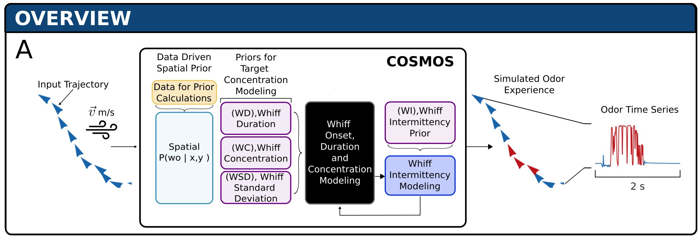

🩺 I am currently a Postdoctoral scholar at the University of Chicago. I analyze lupus data, mainly very large and high resolution codex images and develop machine learning techniques for better cell phenotyping and mapping from human to mouse renal cells. 

#### Ph.D., Computer Science, University of Nevada, Reno
During my Ph.D. in Computer Science at the University of Nevada, Reno, my research leveraged large noisy real-world datasets, to develop predictive models using statistical analysis, machine learning and deep learning methods. I am proficient in Python, C++, and various data analysis/MLOps tools. During my PhD:

🦋 I developed and implemented statistical models and Kalman filtering techniques to enhance estimators for real- world dynamical systems on 15 million rows of real-world data from multiple sensors, resulting in an 82% prediction accuracy. [RSI, 2024](https://royalsocietypublishing.org/doi/full/10.1098/rsif.2024.0169)

🎮 I built a realistic odor simulator, COSMOS (Configurable Odor Simulation Model over Scalable Spaces), that provides an odor experience similar to an outdoor environment using data-driven probabilistic methods for whiff simulation and mathematical tools like logistic transform and autoregressive functions for smooth time series evolution. COSMOS is built with desire to provide a test bench for plume tracing algorithm development. [arXiv, 2025](https://arxiv.org/abs/2505.22436)

🛩️ I also integrated COSMOS with a physics enabled robotic simulator-Gazebo to further simulate the odor tracking challenges such as wind and gravity with an UAV and tested the simulation with a velocity controlled surge and cast algorithm. It was further translated into an actual UAV sysem.

A list of my [publications](https://arunavanag591.github.io/mypage/publications/) and github repositories can be found [here](https://github.com/arunavanag591).

#### Senior Research Engineer, ROS-Industrial Asia Pacific, Singapore
🤖 I worked as a Senior Research Engineer at ROS-Industrial Asia Pacific for three years, where I developed industrial applications leveraging machine learning, robotics, autonomous navigation, computer vision, and virtual reality. During my tenure at ROS-Industrial Asia Pacific, I also served as an instructor for the Robot Operating System. Additionally, I led projects that integrated virtual reality with real-world robotics, significantly enhancing robot operator learning efficiency by 85%.

#### MS, Electrical Engineering (CV & Motion planning), North Carolina State University
🦾 🔧 In 2016, I received my MS in Electrical Engineering at North Carolina State University. My thesis focused on 📷 vision-guided collaborative robotics for manufacturing applications. Specifically, I developed an assembly line featuring multiple artificial agents and robots capable of performing complex assembly tasks of small components using point cloud processing and computer vision techniques.

#### Projects
1. [COSMOS](https://github.com/arunavanag591/COSMOS) : A data-driven probabilistic time series simulator for chemical plumes across spatial scales.
2. [Single cell CAR T patient response modeling](https://github.com/arunavanag591/single-cell-car-t-response-modeling.git) : Modeled patient response for scRNA CAR T therapy using scanpy tools, random forests and CNNs.
3. [GPTalkTerminal](https://github.com/arunavanag591/GPTalkTerminal.git) : This is a command-line assistant implementation using ChatGPT API
4. [GeminiYoutubeSummarizer](https://github.com/arunavanag591/GeminiYoutubeSummarizer.git) : Summarizes a youtube video using Google's Gemini Pro LLM model

